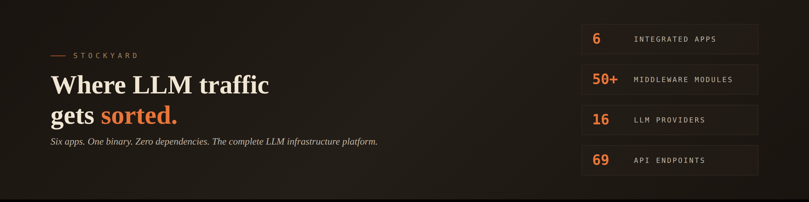
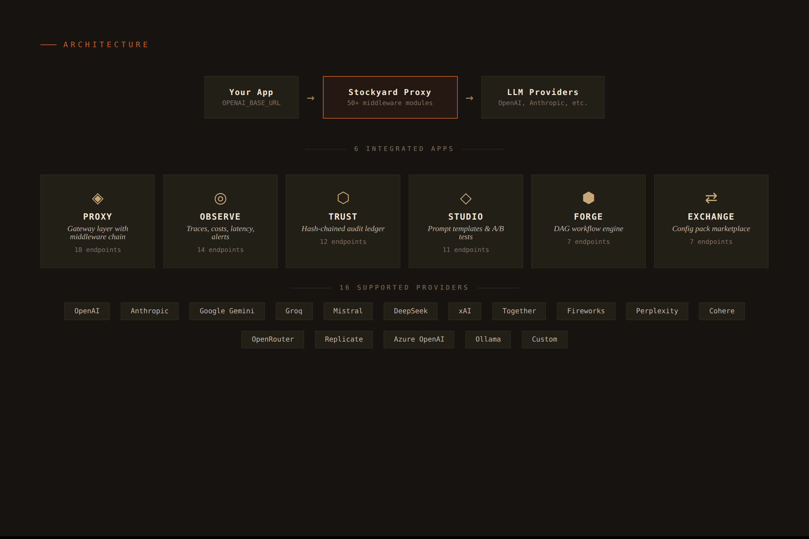
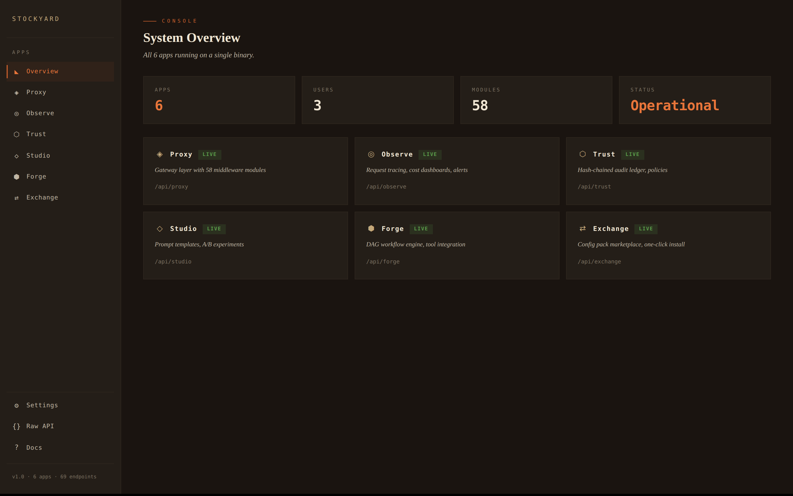
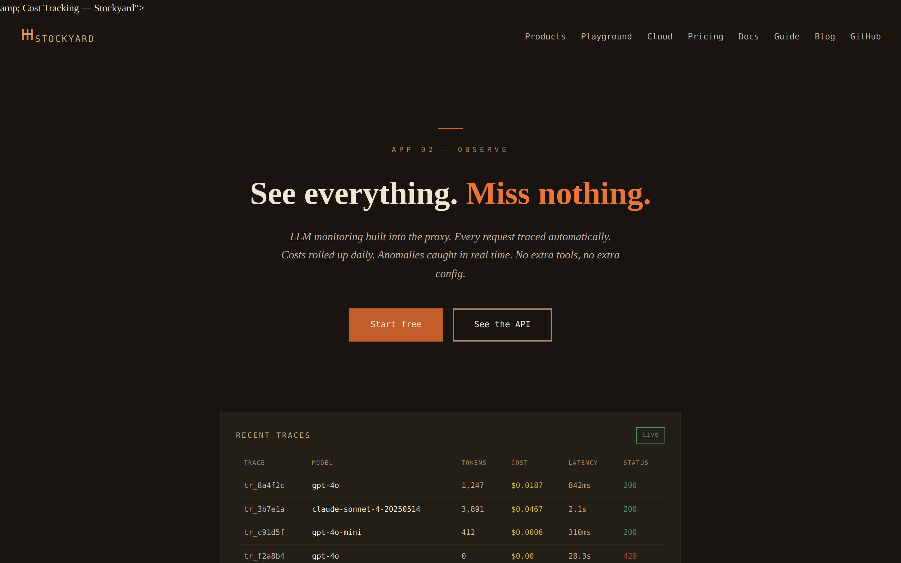
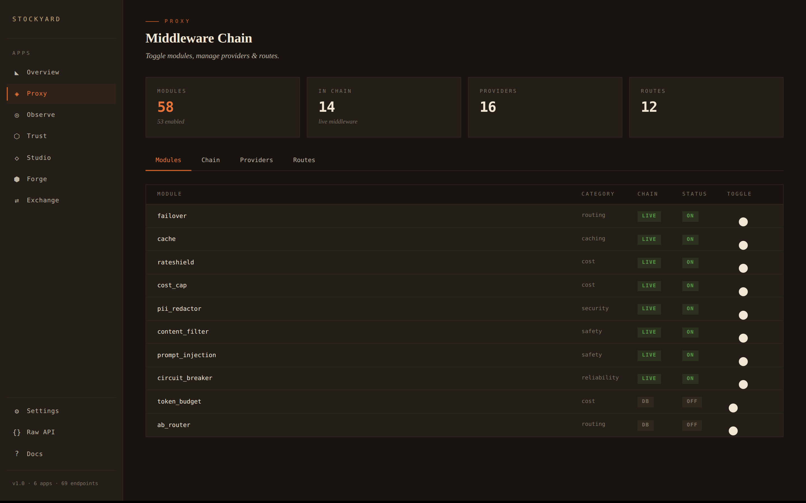
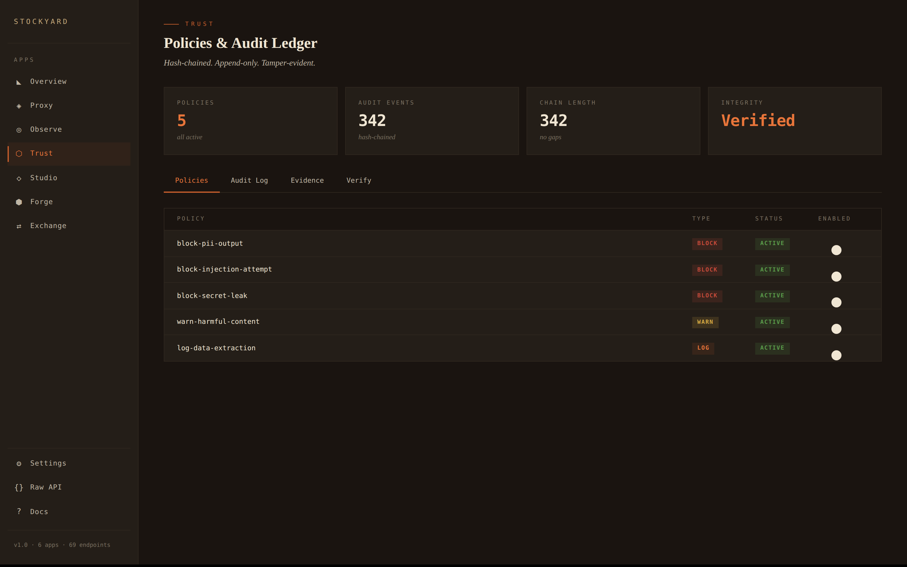
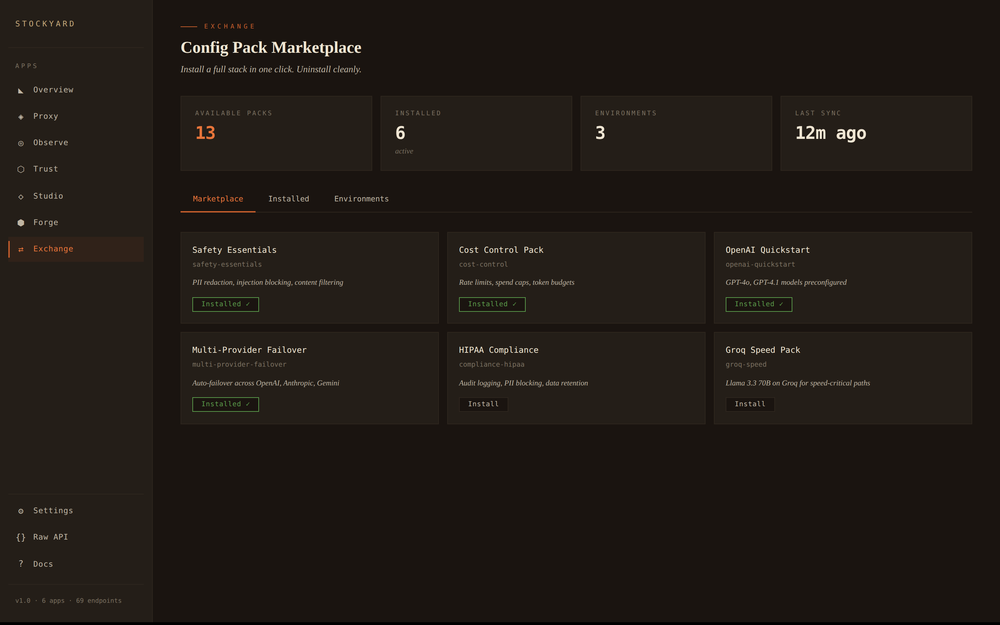

# Stockyard

<p align="center">
  
</p>

<p align="center">
  <a href="https://github.com/stockyard-dev/stockyard/actions/workflows/ci.yml"></a>
  <a href="https://stockyard.dev"></a>
  <a href="https://stockyard.dev/docs"></a>
</p>

**Six apps. One Go binary. Zero dependencies.** The complete LLM infrastructure platform — proxy, observe, trust, studio, forge, and exchange.

[**Try the Playground →**](https://stockyard.dev/playground) — paste an API key, toggle middleware, compare models. No signup.

<p align="center">
  
</p>

## Install

```bash
# One-line install (Linux/macOS)
curl -sSL https://stockyard.dev/install | sh
```

Or run with Docker:

```bash
docker run -d -p 4200:4200 \
  -e STOCKYARD_ADMIN_KEY=my-secret-key \
  -e OPENAI_API_KEY=sk-... \
  -v stockyard-data:/data \
  ghcr.io/stockyard-dev/stockyard
```

Or build from source:

```bash
git clone https://github.com/stockyard-dev/stockyard
cd stockyard
go build -o stockyard ./cmd/stockyard
```

## Quickstart

```bash
# Start the platform (all 6 apps on port 4200)
stockyard

# Or check your environment first
stockyard doctor

# Point your app at the proxy
export OPENAI_BASE_URL=http://localhost:4200/v1

# Make a request — goes through the full middleware chain
curl http://localhost:4200/v1/chat/completions \
  -H "Content-Type: application/json" \
  -H "Authorization: Bearer $OPENAI_API_KEY" \
  -d '{"model":"gpt-4o-mini","messages":[{"role":"user","content":"Hello"}]}'
```

Open `http://localhost:4200/ui` for the web console.

### Console

Every view runs inside the binary — no separate UI service, no Docker sidecar, no setup.

<p align="center">
  
</p>

<details>
<summary><strong>More console views</strong></summary>

**Observe** — traces, costs, latency across all providers:


**Proxy** — 58 middleware modules with runtime toggles:


**Trust** — policies and hash-chained audit ledger:


**Exchange** — config pack marketplace:


</details>

## The Platform

### Proxy (App 01)
58 middleware modules in a chain, every one toggleable at runtime:

| Category | Modules |
|----------|---------|
| Routing | fallbackrouter, modelswitch, regionroute, abrouter, localsync |
| Caching | cachelayer, embedcache, semanticcache |
| Cost | costcap, tierdrop, rateshield, idlekill, outputcap, usagepulse |
| Safety | promptguard, toxicfilter, guardrail, agegate, hallucicheck, secretscan, agentguard |
| Transform | promptslim, tokentrim, contextpack, chatmem, langbridge, voicebridge |
| Validate | structuredshield, evalgate, codefence |
| Observe | llmtap, tracelink, alertpulse, driftwatch |
| Shims | anthrofit (Claude→OpenAI SDK), geminishim (Gemini→OpenAI SDK) |

Toggle any module at runtime:
```bash
# Disable a module (immediate, no restart)
curl -X PUT localhost:4200/api/proxy/modules/toxicfilter -d '{"enabled":false}'

# Re-enable it
curl -X PUT localhost:4200/api/proxy/modules/toxicfilter -d '{"enabled":true}'
```

### Observe (App 02)
Every proxy request is automatically traced with model, tokens, cost, latency, and status.

```bash
curl localhost:4200/api/observe/traces?limit=10  # Recent traces
curl localhost:4200/api/observe/costs             # Daily cost rollups
curl localhost:4200/api/observe/alerts            # Alert rules
curl localhost:4200/api/observe/anomalies         # Detected anomalies
```

### Trust (App 03)
Append-only audit ledger with SHA-256 hash chain. Every request gets a tamper-evident record.

```bash
curl localhost:4200/api/trust/ledger?limit=10     # Audit trail
curl localhost:4200/api/trust/policies             # Trust policies
```

### Studio (App 04)
A/B model comparison, benchmarks, versioned prompt templates.

```bash
# Run an A/B test across models
curl -X POST localhost:4200/api/studio/experiments/run -d '{
  "name": "speed-vs-quality",
  "prompt": "Explain quantum computing in one paragraph",
  "models": ["gpt-4o","claude-sonnet-4-5-20250929","gemini-2.0-flash"],
  "runs": 3,
  "eval": "length"
}'

# Run a multi-prompt benchmark
curl -X POST localhost:4200/api/studio/benchmarks/run -d '{
  "models": ["gpt-4o-mini","deepseek-chat"],
  "prompts": [
    {"name":"summarize","prompt":"Summarize: ...","eval":"concise"},
    {"name":"code","prompt":"Write fizzbuzz in Python","eval":"contains","eval_arg":"for"}
  ]
}'
```

Eval methods: `length`, `concise`, `json`, `contains`, or empty for cost comparison.

### Forge (App 05)
DAG workflow engine. Chain LLM calls with dependency ordering and template variables.

```bash
# Create a multi-step workflow
curl -X POST localhost:4200/api/forge/workflows -d '{
  "slug": "draft-and-critique",
  "name": "Draft + Critique",
  "steps": [
    {"id":"draft","type":"llm","config":{"model":"gpt-4o-mini","prompt":"Write about {{input}}"}},
    {"id":"critique","type":"llm","depends_on":["draft"],
     "config":{"prompt":"Critique: {{steps.draft.output}}"}},
    {"id":"final","type":"transform","depends_on":["draft","critique"],
     "config":{"expression":"concat"}}
  ]
}'

# Run it
curl -X POST localhost:4200/api/forge/workflows/draft-and-critique/run \
  -d '{"input":"the future of AI"}'
```

### Exchange (App 06)
Config pack marketplace. Install providers, modules, routes, workflows, policies, and alerts in one click.

```bash
curl localhost:4200/api/exchange/packs                              # List packs
curl -X POST localhost:4200/api/exchange/packs/safety-essentials/install  # Install
curl -X DELETE localhost:4200/api/exchange/installed/1               # Uninstall
```

**6 starter packs included:** Safety Essentials, Cost Control, OpenAI Quickstart, Anthropic Quickstart, Multi-Provider Failover, Evaluation Suite.

## Auth

### Admin Key
Set `STOCKYARD_ADMIN_KEY` to protect the management API:

```bash
export STOCKYARD_ADMIN_KEY=sk-your-secret-key
stockyard
```

### User Auth (Multi-User)
Stockyard has a built-in user system with per-user API keys and bring-your-own-key provider management:

```bash
# Create a user (returns a sk-sy- API key)
curl -X POST localhost:4200/api/auth/signup \
  -d '{"email":"alice@example.com","name":"Alice"}'

# User adds their own OpenAI key
curl -X PUT localhost:4200/api/auth/me/providers/openai \
  -H "Authorization: Bearer sk-sy-..." \
  -d '{"api_key":"sk-proj-..."}'

# Requests now route through the user's own key
curl localhost:4200/v1/chat/completions \
  -H "Authorization: Bearer sk-sy-..." \
  -d '{"model":"gpt-4o","messages":[{"role":"user","content":"Hello"}]}'
```

Key resolution: user's key → global provider. Users never see each other's keys.

### Auto-Configure (Zero Setup)
Send any provider API key directly — Stockyard detects the provider from the key prefix:

```bash
# Just works — Stockyard detects this is an OpenAI key
curl localhost:4200/v1/chat/completions \
  -H "Authorization: Bearer sk-proj-..." \
  -d '{"model":"gpt-4o","messages":[{"role":"user","content":"Hello"}]}'
```

Detected prefixes: `sk-` → OpenAI, `sk-ant-` → Anthropic, `gsk_` → Groq, `fw_` → Fireworks, `pplx-` → Perplexity, `xai-` → xAI.

## Persistent Storage

Stockyard uses SQLite with zero external dependencies. Set `DATA_DIR` to control where the database lives:

```bash
export DATA_DIR=/var/data/stockyard
stockyard
```

On Railway, attach a volume and set `DATA_DIR` to the mount path. Stockyard also auto-detects `RAILWAY_VOLUME_MOUNT_PATH`.

## Providers

16 providers, auto-configured from environment variables:

| Provider | Env Var | Example Models |
|----------|---------|----------------|
| OpenAI | `OPENAI_API_KEY` | gpt-4o, gpt-4.1, o3-mini |
| Anthropic | `ANTHROPIC_API_KEY` | claude-sonnet-4-5, claude-haiku-4-5 |
| Google Gemini | `GEMINI_API_KEY` | gemini-2.5-pro, gemini-2.0-flash |
| Groq | `GROQ_API_KEY` | llama-3.3-70b, mixtral-8x7b |
| Mistral | `MISTRAL_API_KEY` | mistral-large, codestral |
| DeepSeek | `DEEPSEEK_API_KEY` | deepseek-chat, deepseek-reasoner |
| Together | `TOGETHER_API_KEY` | Llama 3.1-70B, Qwen 2.5-72B |
| Fireworks | `FIREWORKS_API_KEY` | Llama 3.3-70B |
| Perplexity | `PERPLEXITY_API_KEY` | sonar-pro, sonar |
| xAI | `XAI_API_KEY` | grok-3, grok-2 |
| Cohere | `COHERE_API_KEY` | command-r-plus, command-a |
| OpenRouter | `OPENROUTER_API_KEY` | Any model |
| Replicate | `REPLICATE_API_TOKEN` | Any model |
| Azure OpenAI | config | Azure-hosted models |
| Ollama | auto | Any local model (:11434) |
| LM Studio | auto | Any local model (:1234) |

Any OpenAI-compatible endpoint works as a custom provider.

## API

80+ REST endpoints across all 6 apps. Key endpoints:

```
GET  /health                              Health check
GET  /api/apps                            List apps
POST /v1/chat/completions                 Proxy LLM request
GET  /api/proxy/modules                   List modules (58)
PUT  /api/proxy/modules/{name}            Toggle module
GET  /api/proxy/providers                 List providers
POST /api/auth/signup                     Create user + API key
GET  /api/auth/me                         Current user
PUT  /api/auth/me/providers/{name}        Add provider key
POST /api/auth/me/keys/{id}/rotate        Rotate API key
GET  /api/observe/traces                  Recent traces
GET  /api/observe/timeseries?period=7d    Time-bucketed analytics
GET  /api/observe/costs                   Cost rollups
POST /api/observe/alerts                  Create alert
GET  /api/trust/ledger                    Audit trail
GET  /api/trust/policies                  Trust policies
GET  /api/studio/templates                Prompt templates
POST /api/studio/experiments/run          Run A/B test
POST /api/studio/benchmarks/run           Run benchmark
POST /api/forge/workflows                 Create workflow
POST /api/forge/workflows/{slug}/run      Run workflow
GET  /api/exchange/packs                  Available packs
POST /api/exchange/packs/{slug}/install   Install pack
POST /api/webhooks                        Register webhook
POST /api/playground/share                Share playground session
GET  /api/status                          System status + metrics
GET  /api/plans                           Pricing plans
```

## Why not LiteLLM?

| | Stockyard | LiteLLM |
|---|---|---|
| Language | Go | Python |
| Binary | Single static binary | pip install + runtime |
| Dependencies | Zero | Redis, Postgres |
| Platform | 6 integrated apps | One proxy |
| Middleware | 58 toggleable modules | Limited callbacks |
| Memory | ~12MB | ~200MB+ |
| Cold start | <50ms | Seconds |

## Pricing

| Tier | Price | Requests | Users | Retention |
|------|-------|----------|-------|-----------|
| **Community** | Free | 10k/mo | 3 | 7 days |
| **Pro** | $9.99/mo | Unlimited | Unlimited | Unlimited |
| **Cloud** | $29.99/mo | 500k/mo | Unlimited | 30 days |
| **Enterprise** | Custom | Unlimited | Unlimited | 1 year |

All tiers include all 6 apps, 58 modules, and 16 providers. No per-token markup.

**License keys** (Pro/Cloud/Enterprise): Set `STOCKYARD_LICENSE_KEY` to remove Community tier limits. Check status at `GET /api/license`.

```bash
# Check current tier and usage
curl localhost:4200/api/license

# Upgrade: set your license key
export STOCKYARD_LICENSE_KEY="SY-eyJ..."
```

## New in v1.0

- **`stockyard doctor`** — Pre-flight environment check (config, database, ports, API keys, Ollama, disk)
- **OpenTelemetry export** — Set `OTEL_EXPORTER_OTLP_ENDPOINT` to send traces to Jaeger, Grafana, Datadog, Honeycomb
- **Playground sharing** — `POST /api/playground/share` creates shareable playground sessions (30-day TTL)
- **Webhooks** — `POST /api/webhooks` to register Slack or HTTP endpoints for alerts, cost thresholds, trust violations
- **API key rotation** — `POST /api/auth/me/keys/{id}/rotate` atomically revokes and regenerates
- **Status page** — `/status/` with live system metrics, `GET /api/status` for programmatic access
- **GitHub Action** — `stockyard-dev/stockyard/.github/actions/setup-stockyard` for CI/CD pipelines
- **VS Code extension** — Module toggle, trace viewer, status bar indicator
- **12 Go benchmarks** — `go test ./internal/proxy/ -bench=. -benchmem` covers the full middleware chain

## Links

- **Website:** [stockyard.dev](https://stockyard.dev)
- **Playground:** [stockyard.dev/playground](https://stockyard.dev/playground)
- **Docs:** [stockyard.dev/docs](https://stockyard.dev/docs/)
- **Architecture:** [stockyard.dev/architecture](https://stockyard.dev/architecture/)
- **Benchmarks:** [stockyard.dev/benchmarks](https://stockyard.dev/benchmarks/)
- **Blog:** [stockyard.dev/blog](https://stockyard.dev/blog/)
- **Status:** [stockyard.dev/status](https://stockyard.dev/status/)
- **Comparisons:** [vs LiteLLM](https://stockyard.dev/vs/litellm/) · [vs Helicone](https://stockyard.dev/vs/helicone/) · [vs Portkey](https://stockyard.dev/vs/portkey/)
- **Examples:** [examples/](examples/) — Python, Node.js, curl, Docker, webhooks
- **VS Code:** [vscode-extension/](vscode-extension/) — Module toggle, trace viewer, status bar
- **API Health:** [stockyard.dev/health](https://stockyard.dev/health)

## License

See [LICENSE](LICENSE).

