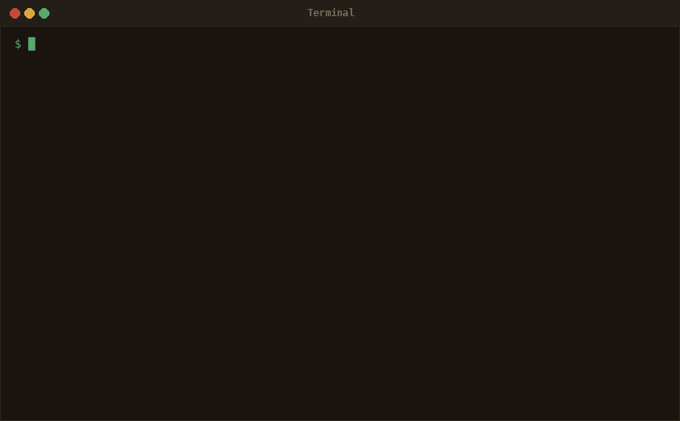

<div align="center">

# ═══ STOCKYARD ═══

### Self-hosted LLM proxy, tracing, and security in one Go binary

[Website](https://stockyard.dev) · [Docs](https://stockyard.dev/docs) · [Quickstart](https://stockyard.dev/docs/quickstart) · [Changelog](https://stockyard.dev/changelog)

[](https://go.dev)
[](LICENSE)
[](https://stockyard.dev/products)
[](https://stockyard.dev/docs)

</div>

---

Stockyard sits between your app and your LLM providers. Point your `OPENAI_BASE_URL` at it and you get cost tracking, caching, safety filters, rate limiting, audit trails, and automatic cost routing — without adding any dependencies to your stack.

Single Go binary (~25MB). Embedded SQLite. No Redis, no Postgres, no Docker required.

## Install → Start → First Trace

<p align="center">
  
</p>

```bash
# Install (~25MB binary)
curl -fsSL https://stockyard.dev/install.sh | sh

# Start (all services on one port)
export OPENAI_API_KEY=sk-...
stockyard start
# → Stockyard running on :7749
# → Proxy:     http://localhost:7749/v1
# → Dashboard: http://localhost:7749/ui
```

```bash
# Send a request through the proxy
curl http://localhost:7749/v1/chat/completions \
  -H "Content-Type: application/json" \
  -H "Authorization: Bearer $OPENAI_API_KEY" \
  -d '{
    "model": "gpt-4o-mini",
    "messages": [{"role": "user", "content": "Hello"}]
  }'
```

That request just flowed through 76 middleware modules — rate limiter, cost tracker, safety filter, cache check, audit logger — and back. Check the results:

```bash
# See the trace (cost, latency, tokens, provider)
curl http://localhost:7749/api/lookout/traces?limit=1

# See the audit event (hash-chained, tamper-evident)
curl http://localhost:7749/api/brand/ledger?limit=1

# See cost attribution
curl http://localhost:7749/api/lookout/costs
```

Or open `http://localhost:7749/ui` for the full dashboard.

## What's Free

Everything you need for production proxy + tracing + audit:

- **Chute** — proxy across 40 LLM providers through one API, 76 middleware modules
- **Lookout** — automatic request tracing, per-model cost dashboards, anomaly detection
- **Brand** — SHA-256 hash-chained audit ledger, policy enforcement, compliance evidence
- **Tack Room** — versioned prompt templates, A/B experiments
- **Team isolation** — per-team API keys with isolated logs, spend tracking, and audit trails
- **Drover** — automatic cost routing, 100 decisions/day free
- **Feral quickscan** — 5 adversarial probes, instant A–F security grade
- Unlimited requests. No credit card. Self-hosted on your infrastructure.

## What Unlocks with Paid Tiers

29 specialized tools unlock as your needs grow ($29.99–$499.99/mo):

| Tier | Price | Key Products |
|------|-------|-------------|
| **Individual** | $29.99/mo | Lasso (request replay), Auction (model bidding), Doubt, Verdikt, Relic |
| **Pro** | $99.99/mo | Drover unlimited, Breed (prompt evolution), Stampede, Fault, Morph |
| **Team** | $299.99/mo | Feral full suite (29 probes), Phantom, Crucible, RBAC, 5 seats |
| **Enterprise** | $499.99/mo | All 29 products, Cortex, Mycelium, Ramrod, SSO, SLA |

Paid tiers add capabilities, not capacity. See [stockyard.dev/pricing](https://stockyard.dev/pricing).

## When Stockyard Is NOT the Right Fit

- **You only need a thin API shim.** If you just want to swap between OpenAI and Anthropic with no middleware, [LiteLLM](https://github.com/BerriAI/litellm) is simpler.
- **You need 100+ provider integrations.** Stockyard supports 40 providers. LiteLLM supports 100+.
- **You want managed-only.** Stockyard is self-hosted. You run the binary on your infrastructure.
- **You need MIT licensing.** Stockyard is BSL 1.1 (source-available, free to use, can't build a competing proxy service).
- **You're not using LLMs in production yet.** Stockyard solves production problems — cost overruns, audit requirements, safety filtering, provider failover.

## Architecture

```
Your App (OpenAI SDK)
        │
        ▼
┌─── STOCKYARD (:7749) ──────────────────────────┐
│                                                  │
│  Request → [76 middleware modules] → Provider    │
│            rate limit → cache → safety →         │
│            cost cap → route → failover           │
│                                                  │
│  ┌──────────┐ ┌──────────┐ ┌──────────┐        │
│  │ Lookout  │ │  Brand   │ │Tack Room │        │
│  │ traces   │ │ audit    │ │ prompts  │        │
│  │ costs    │ │ policies │ │ A/B test │        │
│  └──────────┘ └──────────┘ └──────────┘        │
│  ┌──────────┐ ┌──────────┐                     │
│  │  Drover  │ │  Feral   │  SQLite (WAL)       │
│  │ routing  │ │ red-team │  ~25MB binary        │
│  └──────────┘ └──────────┘  29 products         │
└──────────────────────────────────────────────────┘
```

- **Single binary**, single port, single process. No orchestration.
- **Embedded SQLite** with WAL mode via `modernc.org/sqlite` (pure Go, no CGO).
- **76 middleware modules**, each toggleable at runtime via the API.
- **40 LLM providers**: OpenAI, Anthropic, Gemini, Groq, Mistral, DeepSeek, Ollama, vLLM, Azure OpenAI, Cohere, Together AI, Fireworks, Replicate, Perplexity, Hugging Face, xAI, OpenRouter, DeepInfra, NVIDIA NIM, Cerebras, SambaNova, AI21, and 18 more.
- **AES-256-GCM encryption** for all provider keys at rest.
- **~400ns proxy overhead** across the full middleware chain ([benchmarks](https://stockyard.dev/benchmarks)).

## Use It With Any OpenAI SDK

```python
from openai import OpenAI

client = OpenAI(
    base_url="http://localhost:7749/v1",
    api_key="your-openai-key"
)

response = client.chat.completions.create(
    model="gpt-4o-mini",
    messages=[{"role": "user", "content": "Hello!"}]
)
```

Works with any OpenAI-compatible client — Python, Node, Go, curl.

## Team Isolation

Give each team or project its own API keys. Requests are automatically isolated in logs, traces, spend tracking, and the audit ledger.

```bash
# Create a team
curl -X POST http://localhost:7749/api/teams \
  -H "X-Admin-Key: $ADMIN_KEY" \
  -d '{"name": "Frontend"}'

# Generate a team key
curl -X POST http://localhost:7749/api/teams/1/keys \
  -H "X-Admin-Key: $ADMIN_KEY" \
  -d '{"name": "production"}'
# → {"key": "sk-sy-...", "team_id": 1, ...}

# Use the team key — requests are automatically scoped
curl http://localhost:7749/v1/chat/completions \
  -H "Authorization: Bearer sk-sy-TEAM_KEY" \
  -d '{"model": "gpt-4o", "messages": [...]}'

# View team-scoped spend
curl http://localhost:7749/api/teams/1/spend \
  -H "X-Admin-Key: $ADMIN_KEY"
```

One team cannot see another team's data. The dashboard includes a team picker that filters all views.

## vs LiteLLM

| | Stockyard | LiteLLM |
|---|---|---|
| Language | Go | Python |
| Dependencies | Zero (single binary) | Redis + Postgres |
| Observability | Built-in (Lookout) | External (Langfuse, etc.) |
| Audit trail | Hash-chained ledger (Brand) | Not included |
| Red-team testing | Built-in (Feral, 29 probes) | Not included |
| Auto cost routing | Built-in (Drover) | Basic fallback |
| Request replay | Built-in (Lasso) | Not included |
| Prompt evolution | Built-in (Breed) | Not included |
| Providers | 40 | 100+ |
| Binary size | ~25MB | ~200MB+ Docker image |
| License | BSL 1.1 | MIT |

## Security

- **Provider keys encrypted at rest** — AES-256-GCM with PBKDF2-derived key (100K iterations)
- **Hash-chained audit ledger** — every event cryptographically linked to the previous
- **No key leakage** — provider keys never appear in logs, traces, or API responses
- **Security headers** — HSTS, CSP, X-Frame-Options, X-Content-Type-Options

## Shipped This Week

<!-- SHIPPED-START -->
**20 changes** in the last 7 days:

- **Add generate_lead conversion event on /guide/ page for Google Ads optimization** (2026-03-30)
- **Fix remaining bugs: rows.Err checks, json.Marshal errors, schema Exec, seed transaction** (2026-03-30)
- **Fix 30 bugs: SQL injection, auth bypass, nil panics, unchecked errors, race conditions, resource leaks** (2026-03-30)
- **Fix 10 bug categories: SQL injection, error handling, goroutine leaks, timeouts** (2026-03-30)
- **Fix 6 bugs: GitHub API field, XFF spoofing, Content-Type headers, shadowing, goroutine cleanup, CSP** (2026-03-30)
- **Add Google Ads tag (AW-18046975504) to all 101 site pages** (2026-03-29)
- **Playground share backend: public routes, traces, body limit** (2026-03-29)
- **feat: auto-fetch GitHub stats in growth dashboard** (2026-03-29)
- **fix: dashboard uses canonical western product names + dynamic product count** (2026-03-29)
- **fix: TrustView template close — need backtick-}-backtick not double-backtick** (2026-03-29)
- **fix: dashboard SyntaxError — TrustView had unclosed template literal** (2026-03-29)
- **fix: dashboard error visibility + localStorage crash + loading state** (2026-03-29)
- **fix: eliminate all raw sessionStorage calls — 6 remaining refs now use ss()** (2026-03-29)
- **fix: dashboard blank page on mobile — wrap sessionStorage in try-catch** (2026-03-29)
- **fix: dashboard blank page — missing ternary in proxy.js + growth metric cleanup** (2026-03-29)
- **fix: remove GA4 from dashboard (causes blank page on mobile), update CSP for GA4 on site pages** (2026-03-29)
- **fix: remove duplicate 13-growth.js in dashboard build script** (2026-03-29)
- **rebuild: growth dashboard build with all 15 components** (2026-03-29)
- **wire growth dashboard into dashboard build — mission control page live** (2026-03-29)
- **feat: persistent install tracking in SQLite — real adoption telemetry** (2026-03-29)

_See [full changelog](https://stockyard.dev/changelog/) for details._
<!-- SHIPPED-END -->

## Build from Source

```bash
git clone https://github.com/stockyard-dev/Stockyard.git
cd Stockyard
CGO_ENABLED=0 go build -o stockyard ./cmd/stockyard/
./stockyard start
```

Requires Go 1.22+. No other dependencies.

## Documentation

- [Quickstart (5 min)](https://stockyard.dev/docs/quickstart)
- [Configuration](https://stockyard.dev/docs/config)
- [SDKs (Python, Go, TypeScript)](https://stockyard.dev/docs/sdks)
- [API Reference (360+ endpoints)](https://stockyard.dev/docs/api)
- [Team Key Isolation](https://stockyard.dev/docs/team)
- [Products](https://stockyard.dev/products)
- [Benchmarks](https://stockyard.dev/benchmarks)
- [vs LiteLLM](https://stockyard.dev/vs/litellm)

## License

Stockyard is licensed under the [Business Source License 1.1](LICENSE). Source-available — free to use, modify, and self-host. You may not use it to offer a competing LLM proxy service. See LICENSE for details.

---

<div align="center">

**[stockyard.dev](https://stockyard.dev)**

</div>
